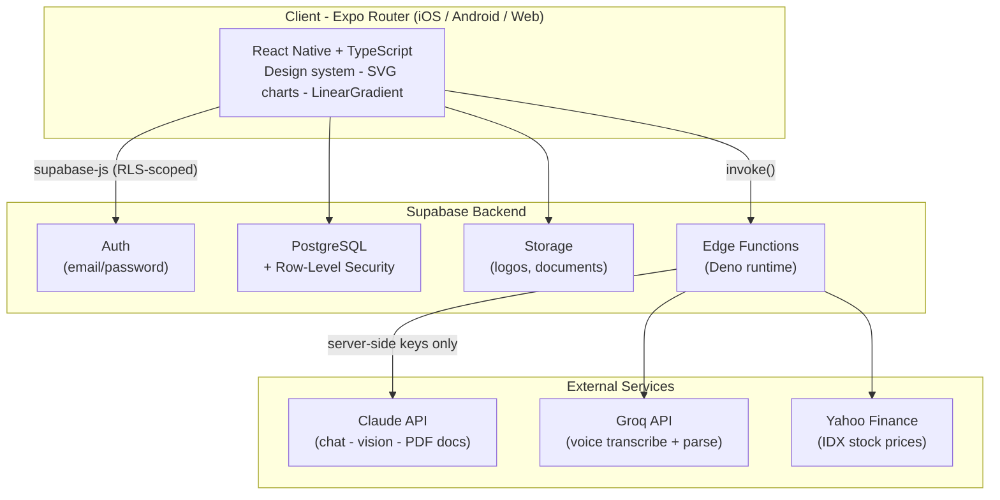

<div align="center">

# 🏦 Zena

### Keuanganmu, selaras.

**A production-grade personal & business finance super-app for Indonesia — AI-powered, mobile-first, and built end-to-end by a solo developer.**

[](https://expo.dev/)
[](https://reactnative.dev/)
[](https://www.typescriptlang.org/)
[](https://supabase.com/)
[](https://www.anthropic.com/)
[]()

[Live Web Demo](https://zena-mu.vercel.app) · [Features](#-features) · [Architecture](#%EF%B8%8F-architecture) · [Tech Stack](#-tech-stack) · [Security](#-security)

</div>

---

## 📖 Overview

**Zena** is a finance management app that unifies two worlds most apps keep separate: **personal money management** and **small-business operations** — in a single mode-switchable interface inspired by banking super-apps (Livin', Binance).

A user tracks daily spending and budgets in **Personal mode**, then flips a toggle into **Business mode** to manage projects, receivables, inventory, taxes, and generate **invoices & quotations** — all backed by an AI assistant that understands their actual transaction history.

Built solo as a full-stack project: mobile + web frontend, database design, row-level security, serverless edge functions, and AI integration.

> **Status:** Actively developed · Web build live on Vercel · Android build via EAS · 33 screens · 14 edge functions

---

## ✨ Features

### 👤 Personal Finance
- **Multi-wallet management** — cash, bank, e-wallet, with inter-wallet transfers
- **Transaction tracking** — income / expense / transfer, custom categories & dates
- **Smart budgeting** — 50/30/20 method with live budget alerts (75% / 90% / 100%)
- **Monthly reports** — category breakdown, cashflow trend chart, saving-rate indicator
- **Financial Health score** — gauge-based 0–100 rating across budget, consistency, savings, investment & debt
- **Gamification** — XP, tiers (Starter → Sovereign), badges & rank — all derived from real behavior
- **Investment portfolio** — stocks (IDX, live prices via Yahoo Finance), crypto, mutual funds, bonds

### 💼 Business Mode
- **Projects** — contract value, payment terms (termin), profit/margin stats
- **Receivables & payables** — piutang/hutang tracking with WhatsApp reminders
- **Inventory** — products, stock movements, low-stock alerts, stock opname, product variants
- **HPP (COGS) & PPN (VAT)** — auto-recorded cost of goods, inclusive/exclusive tax, monthly tax summary
- **Invoice & Quotation generator** — locked sequential numbering (`003/ABBR/VI/2026`), 3 templates, logo & bank details, share via WhatsApp, export to PDF
- **Quote → Project automation** — an approved quotation becomes an active project **and** a receivable in one tap

### 🤖 AI & Automation
- **Conversational AI assistant** — Claude-powered, context-aware over 3 months of transactions, 6 personas, end-of-month forecasting
- **Receipt OCR** — snap a receipt, Claude Vision auto-fills the transaction form
- **Voice input** — speak a transaction, Groq Whisper transcribes + parses it
- **Zena Intelligence** — autonomous agents for budget monitoring, anomaly detection, weekly insights & daily summaries

---

## 🖼️ Screenshots

> Add your images to `docs/screenshots/` and they'll render here.

| Home (Personal) | Home (Business) | Invoice Preview | AI Assistant |
|:---:|:---:|:---:|:---:|
|  |  |  |  |

---

## 🏗️ Architecture



**Design principles**
- **Security-first** — API keys never touch the client; all sensitive calls proxied through edge functions. Every table guarded by Row-Level Security.
- **Edge for sensitive ops** — AI proxying, PDF/document generation, and price fetching run server-side in Deno.
- **Atomic where it matters** — invoice numbering uses a Postgres RPC to guarantee no duplicate document numbers under concurrency.
- **Cross-platform from one codebase** — the same Expo Router code ships to iOS, Android, and web.

---

## 🛠️ Tech Stack

| Layer | Technology |
|---|---|
| **Frontend** | React Native (Expo SDK 56), TypeScript, Expo Router (file-based) |
| **UI** | Custom design system, `react-native-svg` (charts/gauges), `expo-linear-gradient`, Ionicons |
| **Backend** | Supabase — PostgreSQL, Auth, Storage, Row-Level Security |
| **Serverless** | Supabase Edge Functions (Deno) |
| **AI** | Anthropic Claude (chat, vision, document generation), Groq (Whisper + LLM parsing) |
| **Data** | Yahoo Finance (IDX stock prices), CoinGecko (crypto) |
| **Deploy** | Vercel (web), EAS Build (Android/iOS) |
| **Tooling** | TypeScript strict mode (`tsc --noEmit` gate), psql/REST migrations |

---

## 🔐 Security

- **Row-Level Security (RLS)** on every user-owned table — users can only ever read/write their own rows (`auth.uid() = user_id`).
- **No secrets on the client** — Claude/Groq API keys live only in edge-function environment variables.
- **Input validation** across financial inputs (amounts, tax rates, dates).
- **Auth hardening** — persistent sessions (AsyncStorage on native, localStorage on web), deferred auth-state handling to avoid deadlocks.

---

## 📂 Project Structure

```
zena/
├── app/                     # Expo Router screens (file-based routing)
│   ├── (tabs)/              # Home, Reports, Add, Reminder, Profile
│   ├── documents.tsx        # Invoice & quotation list
│   ├── document-form.tsx    # Create / edit document
│   ├── document-preview.tsx # Preview + WhatsApp + PDF + quote→project
│   ├── business-*.tsx       # Projects, inventory, receivables, detail
│   ├── financial-health.tsx
│   └── profil-bisnis.tsx    # Business profile + bank accounts
├── components/              # Reusable UI (charts, modals, widgets)
├── lib/                     # Domain logic (scoring, gamification, docNumber, alert, upload)
├── constants/              # Design system (theme), business constants
├── types/                   # Shared TypeScript types
├── supabase/functions/      # 14 Deno edge functions
│   ├── claude-proxy/        # AI chat proxy
│   ├── generate-document-pdf/
│   ├── groq-transcribe/     # Voice → text
│   ├── stock-price/         # IDX prices
│   └── ...
└── *.sql                    # Schema & migration scripts
```

---

## 🚀 Getting Started

> Requires Node.js 18 or 20, an Expo account, and a Supabase project.

```bash
# 1. Clone
git clone https://github.com/rasyidaldy10/zena.git
cd zena

# 2. Install
npm install

# 3. Configure environment
cp .env.example .env        # then fill in your own keys (see below)

# 4. Run
npx expo start              # native (Expo Go / dev build)
npx expo start --web        # web
```

**Environment variables** (`.env`):

```bash
EXPO_PUBLIC_SUPABASE_URL=https://<your-project>.supabase.co
EXPO_PUBLIC_SUPABASE_ANON_KEY=<your-anon-key>
# Server-side only (edge function secrets — never bundled into the client):
# SUPABASE_SERVICE_ROLE_KEY, ANTHROPIC_API_KEY, GROQ_API_KEY
```

Database schema lives in the root `*.sql` files (run them in the Supabase SQL Editor). Deploy edge functions with:

```bash
supabase functions deploy <name> --project-ref <your-ref>
```

---

## 🗺️ Roadmap

- [ ] Couple mode — shared wallets & joint transactions
- [ ] Server-side native PDF rendering for documents
- [ ] Push notifications (FCM) for budget alerts & daily summaries
- [ ] PDF export for monthly/yearly reports
- [ ] Play Store & App Store release

---

## 👤 Author

**Abdur Rasyid** — full-stack & mobile developer

Designed, architected, and built end-to-end: UX, database design, RLS policies, edge functions, and AI integration.

[](https://github.com/rasyidaldy10)

---

<div align="center">
<sub>Built with React Native, Supabase &amp; Claude. · <strong>Zena — Keuanganmu, selaras.</strong></sub>
</div>
